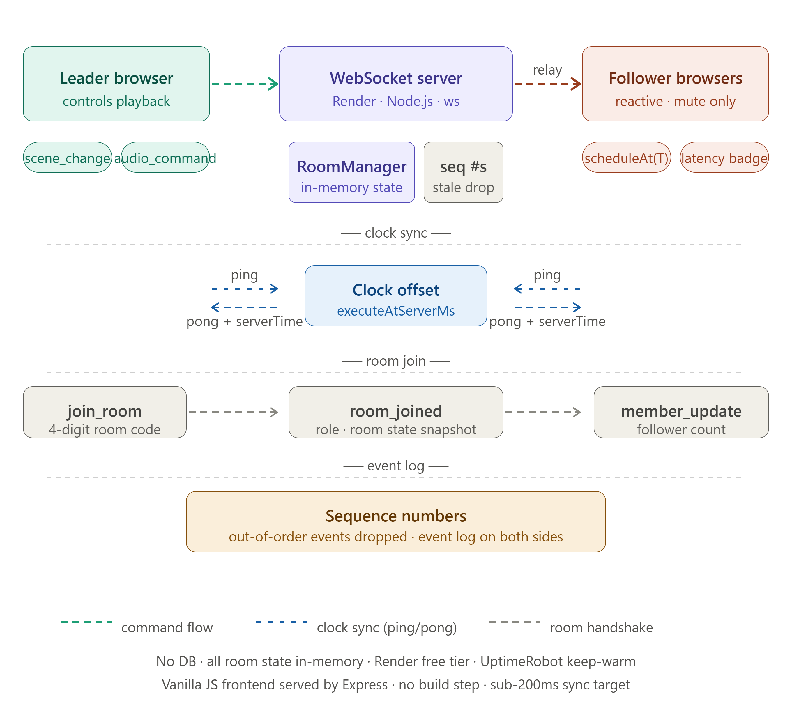

# websocket-audio-sync

> Real-time multi-device audio guide synchronisation over WebSocket — leader controls playback, followers receive timestamped commands and play in sync with sub-200ms alignment.

<video src="https://github.com/user-attachments/assets/ee1bac52-d08b-4fe9-a013-0ffcfaf706ed" autoplay loop muted playsinline width="100%"></video>


---

## Why this exists

Museum and cultural tour groups need every visitor device to hear narration at the same moment — one person skips ahead and the whole group loses sync.
Traditional approaches play audio independently on each device with no coordination layer.
This runtime lets one leader device control playback over WebSocket; every follower schedules audio at `executeAtServerMs` for sub-200ms alignment across the room.

**Live demo:** https://realtimesync.onrender.com

Open two tabs — one as leader, one as follower. The leader controls everything; followers are fully reactive.

---

## Architecture



```
Leader browser                 WebSocket Server (Render)         Follower browsers
──────────────                 ─────────────────────────         ─────────────────
Tab click → scene_change  →   RoomManager (in-memory)      →    scheduleAt(executeAtServerMs)
Play/pause/seek           →   seq# validation + relay       →    apply at T+clockOffset
ping →                        serverTime                    →    ← pong (clock sync)
```

---

## Stack

| Layer | Technology |
|---|---|
| Server | Node.js 22 · TypeScript · Express |
| WebSocket | `ws` library (no Socket.io) |
| Frontend | Vanilla JS · CSS (served by Express, no build step) |
| Deploy | Render (single service — Express serves static frontend) |
| DB | None — room state is in-memory |

---

## Quick start

**Prerequisites:** Node.js >= 22 · npm >= 10

```bash
git clone https://github.com/sujoymondal87/websocket-audio-sync
cd websocket-audio-sync
cp .env.example .env
npm install
npm run dev
```

Open http://localhost:3001 — then open a second tab and join the same room code as a follower.

Verify the backend is live:
```bash
curl http://localhost:3001/health
```

---

## Why this exists — engineering version

### Key engineering decisions

**Why `ws` directly instead of Socket.io?**
Socket.io adds ~30KB of abstraction, automatic reconnection logic, and a polling fallback — none of which are needed here. Raw `ws` gives full control over the message schema and connection lifecycle with zero overhead. The protocol is simple enough that the abstraction would hide more than it helps.

**Why in-memory room state instead of Redis or a database?**
Audio sync is inherently ephemeral — a room exists only while a session is live. Persisting room state adds latency on every relay and introduces consistency concerns with no benefit. If the server restarts, the room is gone and users rejoin. That tradeoff is acceptable for a live session tool.

**Why clock offset via ping/pong instead of relying on system clocks?**
Client system clocks can differ by hundreds of milliseconds, and you cannot trust them to be in sync. The ping/pong round-trip gives an estimated server time at the client: `serverTime + (roundTripMs / 2)`. Followers then schedule audio at `executeAtServerMs` relative to that offset — giving deterministic, sub-200ms alignment regardless of individual device clock drift.

**Why vanilla JS instead of React?**
No build step means the frontend can be served directly by Express from `public/` without Vite, webpack, or a separate deploy. The UI state is simple enough (room code, current stop, play state) that a framework adds complexity rather than removing it.

**Why sequence numbers on every message?**
WebSocket delivery is ordered per connection but network conditions can cause late-arriving messages after a reconnect. Sequence numbers let followers detect and silently drop stale commands rather than applying an out-of-order seek that would break sync.

---

## Trade-offs

| Trade-off | Detail |
|---|---|
| Room state lost on restart | In-memory only — server restart clears all rooms. Acceptable for live sessions. |
| No auth on room codes | 4-digit codes are guessable. Designed for controlled demo environments, not public production. |
| Clock sync degrades on high latency | The ping/pong offset estimate assumes symmetric network delay. On asymmetric or high-jitter connections, the offset error increases. |
| Single server — no horizontal scale | RoomManager is in-process. Scaling to multiple instances would require moving room state to Redis. |
| No reconnection recovery | If a follower disconnects mid-session, they rejoin as a fresh client and get the current room snapshot but miss event history. |

---

## Protocol

All messages are JSON with a `type` field.

### Client → Server

| type | purpose | key fields |
|---|---|---|
| `join_room` | Enter a room | `roomId`, `role` |
| `ping` | Clock sync | `clientTime` |
| `audio_command` | Play / pause / seek / stop | `command`, `blockId`, `positionSec` |
| `scene_change` | Jump to a stop | `blockId` |

### Server → Client

| type | purpose |
|---|---|
| `welcome` | Connection ack + `clientId` |
| `room_joined` | Role confirmed + current room state snapshot |
| `pong` | Clock sync reply — `clientTime`, `serverTime` |
| `relay` | Forwarded command from leader to all followers |
| `member_update` | Follower count changed |
| `error` | Validation failure |

---

## Environment variables

| Key | Required | Default | Description |
|---|---|---|---|
| `PORT` | No | `3001` | Server port |
| `NODE_ENV` | No | `development` | Environment flag |
| `NODE_VERSION` | Render only | `22.11.0` | Pin Node version on Render |
| `NPM_CONFIG_PRODUCTION` | Render only | `false` | Ensures devDependencies install on Render |

---

## Deployment (Render)

| Setting | Value |
|---|---|
| Root directory | `.` |
| Build command | `npm install && npm run build` |
| Start command | `npm start` |
| Node version | `22.11.0` |

Environment vars to set on Render: `NODE_VERSION=22.11.0`, `NPM_CONFIG_PRODUCTION=false`, `PORT=3001`

Keep-warm: UptimeRobot pings `/health` every 5 minutes to prevent Render free-tier spin-down.

---

## Production context

Derived from the WebSocket broadcast layer in the Neareo/MyAppZone production platform — a no-code app builder serving cultural institutions across Spain, France, and Belgium. The production system coordinates audio playback across kiosk and visitor devices during live guided tours, with 30+ institutions live and 600+ verified reviews across 35+ countries.

---

## License

MIT
